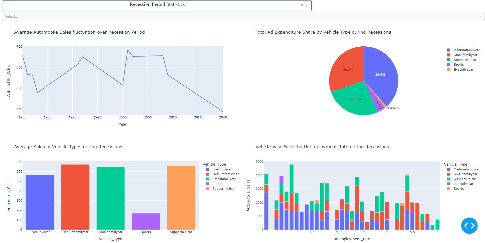

# Automobile Statistics Dashboard

This is the final project for the [IBM Data Visualization with Python](https://www.coursera.org/learn/python-for-data-visualization) course on Coursera. The dashboard is designed to provide insights into automobile sales and related statistics, with a focus on yearly and recession period analyses. This projects primarily utilizes Dash and Plotly libraries and demonstrates foundational skills in data visualization. 

## Getting Started

To run the dashboard locally, make sure you have Python installed on your machine. Additionally, install the required libraries using the following command:

```bash
pip install dash pandas plotly
```

Clone the repository and navigate to the project directory:

```bash
git clone https://github.com/EzraHsieh/AutomobileStatsDashboard.git
cd AutomobileStatsDashboard
```

Run the dashboard script:

```bash
python AutoStatsDash.py
```

Visit http://127.0.0.1:8050/ in your web browser to view the dashboard.

## Features

### Yearly Statistics

- **Average Automobile Sales Over Time:** Line chart displaying the average automobile sales fluctuation over the entire dataset.
- **Total Monthly Automobile Sales:** Line chart illustrating the total monthly automobile sales for the selected year.
- **Average Vehicles Sold by Vehicle Type:** Bar chart showcasing the average number of vehicles sold by vehicle type in the selected year.
- **Total Ad Expenditure by Vehicle Type:** Pie chart presenting the total advertising expenditure for each vehicle type in the selected year.

### Recession Period Statistics

- **Average Automobile Sales During Recession:** Line chart displaying the average automobile sales fluctuation over recession periods.
- **Average Sales of Vehicle Types During Recessions:** Bar chart indicating the average sales of different vehicle types during recession periods.
- **Total Ad Expenditure Share During Recessions:** Pie chart illustrating the share of total advertising expenditure by vehicle type during recession periods.
- **Vehicle-wise Sales by Unemployment Rate During Recessions:** Bar chart showcasing the effect of the unemployment rate on vehicle-wise sales during recession periods.

## Usage

- Select the desired statistics type (Yearly Statistics or Recession Period Statistics) from the dropdown menu.
- If choosing Yearly Statistics, further select the specific year of interest from the dropdown.
- The dashboard will dynamically update to display the relevant charts based on your selections.

Feel free to explore and gain insights into the historical automobile sales dataset!

## Author

[Ezra Hsieh](https://github.com/EzraHsieh/)

## Acknowledgments

- This project was completed as part of the [IBM Data Visualization with Python](https://www.coursera.org/learn/python-for-data-visualization).
- Special thanks to Dr. Pooja for designing the project assignment and skeleton code. 
- Thanks to Saishruthi Swaminathanand, other course instructors, and the IBM Developer Skills Network for providing the dataset and guidance throughout the course.


